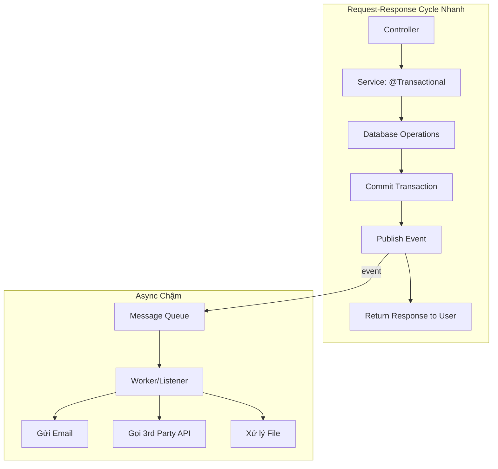
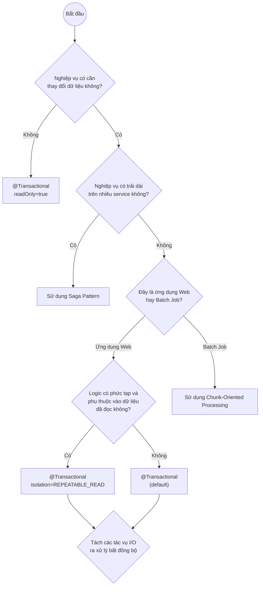

# Tối ưu Hiệu suất & Xử lý Bất đồng bộ với Transaction: Nguyên tắc Vàng

Đây là bản tổng hợp các nguyên tắc và chiến lược cốt lõi để cân bằng giữa tính toàn vẹn dữ liệu và hiệu suất hệ thống.

## 1. Bốn Quy tắc Vàng của Transaction

1.  **Giữ Transaction Ngắn Nhất Có Thể**: Đây là quy tắc quan trọng nhất. Transaction càng ngắn, lock được giữ càng ít thời gian, concurrency càng cao.
2.  **Không Bao Giờ Thực Hiện I/O Trong Transaction**: Không gọi API, không gửi email, không truy cập hệ thống file. Tách biệt hoàn toàn các thao tác CSDL khỏi các thao tác I/O.
3.  **Chọn Mức Isolation Thấp Nhất Có Thể**: Bắt đầu với `READ_COMMITTED`. Chỉ tăng lên `REPEATABLE_READ` hoặc `SERIALIZABLE` khi nghiệp vụ thực sự yêu cầu và bạn hiểu rõ sự đánh đổi về hiệu suất.
4.  **Hiểu Rõ về Propagation**: Sử dụng `REQUIRED` cho hầu hết các trường hợp. Dùng `REQUIRES_NEW` một cách có chủ đích cho các tác vụ phụ trợ như logging, audit.

## 2. Sức mạnh của Bất đồng bộ (Asynchronicity)

Xử lý bất đồng bộ là công cụ mạnh mẽ nhất để cải thiện hiệu suất và trải nghiệm người dùng. Nó cho phép bạn kết thúc transaction của người dùng ngay lập tức và thực hiện các tác vụ tốn thời gian ở chế độ nền.

**Các kỹ thuật phổ biến:**

-   **Spring `@Async`**: Đơn giản để bắt đầu. Phù hợp cho các tác vụ không quá quan trọng, nếu thất bại cũng không ảnh hưởng lớn.
-   **Spring Events (`@EventListener`)**: Cách tuyệt vời để découple các thành phần trong cùng một ứng dụng. Có thể kết hợp với `@Async`.
-   **Message Queues (RabbitMQ, Kafka, SQS)**: Giải pháp mạnh mẽ và đáng tin cậy nhất. Đảm bảo message sẽ được xử lý ngay cả khi service bị lỗi. Bắt buộc phải có trong kiến trúc microservices.

## 3. Sơ đồ Cây Quyết định: Chọn Chiến lược Transaction

Sơ đồ này giúp bạn chọn đúng chiến lược cho từng tình huống.

## 4. Bảng tổng hợp các chiến lược

| Kiến trúc | Vấn đề chính | Giải pháp | Mức nhất quán |
| :--- | :--- | :--- | :--- |
| **Monolith (Web App)** | Thời gian phản hồi cho người dùng, lock database. | Giữ transaction ngắn, xử lý I/O bất đồng bộ. | **Strong Consistency** (ACID) |
| **Monolith (Batch Job)** | Thời gian chạy dài, khối lượng dữ liệu lớn, khả năng restart. | Chunk-Oriented Processing. | **Strong Consistency** (trong từng chunk) |
| **Microservices** | Không thể có transaction ACID trên nhiều service. | Saga Pattern (Orchestration/Choreography). | **Eventual Consistency** |

## 5. Giám sát (Monitoring) là Bắt buộc

Bạn không thể tối ưu cái bạn không đo lường.

-   **Transaction Duration**: Theo dõi thời gian thực thi trung bình và p99 của các transaction. Cảnh báo nếu có transaction nào chạy quá lâu.
-   **Rollback Rate**: Tỷ lệ rollback cao có thể chỉ ra lỗi trong code hoặc vấn đề về dữ liệu.
-   **Deadlocks**: Theo dõi và cảnh báo khi có deadlock xảy ra. Đây là dấu hiệu của việc thiết kế transaction chưa tốt.
-   **Connection Pool Usage**: Đảm bảo connection pool của bạn đủ lớn nhưng không quá dư thừa. `REQUIRES_NEW` có thể làm cạn kiệt pool rất nhanh.

**Công cụ**: Sử dụng các công cụ APM (Application Performance Monitoring) như Prometheus/Grafana, Datadog, New Relic để có dashboard giám sát các chỉ số này.

---

Bằng cách áp dụng các nguyên tắc này, bạn có thể xây dựng các hệ thống không chỉ đảm bảo tính toàn vẹn dữ liệu mà còn có hiệu suất cao, khả năng mở rộng tốt và mang lại trải nghiệm tốt cho người dùng.