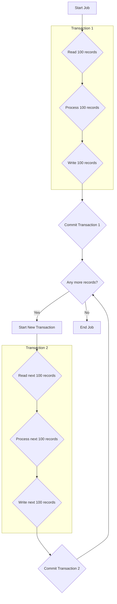

# Chiến lược Transaction cho Xử lý hàng loạt (Batch Processing)

Xử lý hàng loạt (batch jobs) có những đặc thù riêng biệt:
- **Thời gian chạy dài**: Có thể từ vài phút đến vài giờ.
- **Khối lượng dữ liệu lớn**: Xử lý hàng ngàn, hàng triệu bản ghi.
- **Yêu cầu về khả năng phục hồi**: Nếu job bị lỗi giữa chừng, nó phải có khả năng bắt đầu lại từ điểm bị lỗi, chứ không phải từ đầu.

## 1. Anti-Pattern: Một Transaction Toàn cục

Tuyệt đối **KHÔNG** bao giờ bọc toàn bộ một batch job trong một `@Transactional` duy nhất.

```java
// ❌ ANTI-PATTERN: TUYỆT ĐỐI KHÔNG LÀM VẬY
@Transactional
public void processEntireFile() {
    // Đọc 1 triệu dòng từ file
    // Xử lý và lưu vào DB
    // -> Transaction sẽ giữ lock hàng giờ, gây treo DB và sập hệ thống.
}
```

## 2. Giải pháp: Chunk-Oriented Processing (Xử lý theo khối)

Đây là mẫu thiết kế tiêu chuẩn cho các hệ thống batch, được hiện thực hóa trong các framework như **Spring Batch**.

**Ý tưởng**: Chia công việc thành các **khối (chunks)** nhỏ và độc lập. Mỗi khối được xử lý trong một **transaction riêng biệt**.

**Luồng hoạt động:**

1.  **Read**: Đọc một lượng nhỏ dữ liệu (ví dụ: 100 bản ghi) vào bộ nhớ.
2.  **Process**: Xử lý logic nghiệp vụ cho từng bản ghi trong khối đó.
3.  **Write**: Ghi toàn bộ khối đã xử lý vào database.

Toàn bộ chu trình `Read-Process-Write` cho một khối được bọc trong một transaction.



## 3. Lợi ích của Xử lý theo khối

- **Hiệu suất**: Transaction ngắn, giải phóng lock nhanh chóng, không gây ảnh hưởng đến các tiến trình khác đang chạy trên DB.
- **Khả năng phục hồi (Restartability)**: Framework (như Spring Batch) sẽ lưu lại trạng thái sau mỗi khối được commit thành công. Nếu job bị lỗi ở khối thứ 51, bạn có thể khởi động lại job từ đầu khối 51, tiết kiệm thời gian xử lý lại 50 khối đầu tiên.
- **Quản lý bộ nhớ**: Chỉ một lượng nhỏ dữ liệu được giữ trong bộ nhớ tại một thời điểm, tránh được `OutOfMemoryError`.

## 4. Quản lý Transaction trong Spring Batch

Spring Batch tự động quản lý transaction cho mỗi khối. Bạn không cần phải khai báo `@Transactional` cho cả step.

```java
@Configuration
public class CsvToDbJobConfig {

    @Bean
    public Step csvToDbStep(JobRepository jobRepository, PlatformTransactionManager transactionManager) {
        return new StepBuilder("csvToDbStep", jobRepository)
                .<InputData, OutputData>chunk(100, transactionManager) // <-- Mỗi chunk 100 bản ghi, mỗi chunk 1 transaction
                .reader(itemReader())
                .processor(itemProcessor())
                .writer(itemWriter())
                .build();
    }
    // ... reader, processor, writer beans
}
```

## 5. Xử lý lỗi và Bỏ qua (Skip Logic)

Một yêu cầu phổ biến trong batch là nếu một vài bản ghi bị lỗi (ví dụ: dữ liệu không hợp lệ), job không nên dừng lại hoàn toàn mà nên bỏ qua các bản ghi lỗi và tiếp tục.

- **Chiến lược**:
    - **Skip**: Cấu hình để bỏ qua một số loại exception nhất định.
    - **Retry**: Thử xử lý lại một bản ghi nếu gặp lỗi tạm thời (ví dụ: deadlock).
    - **Propagation.NESTED**: Có thể sử dụng `NESTED` propagation (nếu DB hỗ trợ savepoint) bên trong `ItemProcessor` để thử một thao tác phụ. Nếu nó thất bại, transaction của khối vẫn có thể tiếp tục mà không cần rollback toàn bộ khối.

```java
@Bean
public Step csvToDbStep(...) {
    return new StepBuilder("csvToDbStep", jobRepository)
            .<InputData, OutputData>chunk(100, transactionManager)
            .reader(...)
            .processor(...)
            .writer(...)
            .faultTolerant() // Bật tính năng chịu lỗi
            .skip(InvalidDataException.class) // Bỏ qua nếu gặp exception này
            .skipLimit(10) // Cho phép bỏ qua tối đa 10 bản ghi
            .retry(OptimisticLockingFailureException.class) // Thử lại nếu gặp lỗi này
            .retryLimit(3) // Thử lại tối đa 3 lần
            .build();
}
```

## 6. Kết luận cho Xử lý hàng loạt

| Yêu cầu | Chiến lược đề xuất | Ghi chú |
| :--- | :--- | :--- |
| **Xử lý dữ liệu lớn** | **Chunk-Oriented Processing** | Chia để trị. Không bao giờ dùng một transaction duy nhất. |
| **Khả năng khởi động lại** | Sử dụng framework như **Spring Batch** | Framework sẽ tự động quản lý trạng thái (state) của job. |
| **Xử lý lỗi cục bộ** | **Fault Tolerance** (Skip/Retry) | Cho phép job tiếp tục chạy dù gặp một vài bản ghi lỗi. |
| **Isolation Level** | `READ_COMMITTED` thường là đủ. | Vì mỗi khối là một transaction độc lập, nhu cầu về isolation phức tạp thường không cao. |