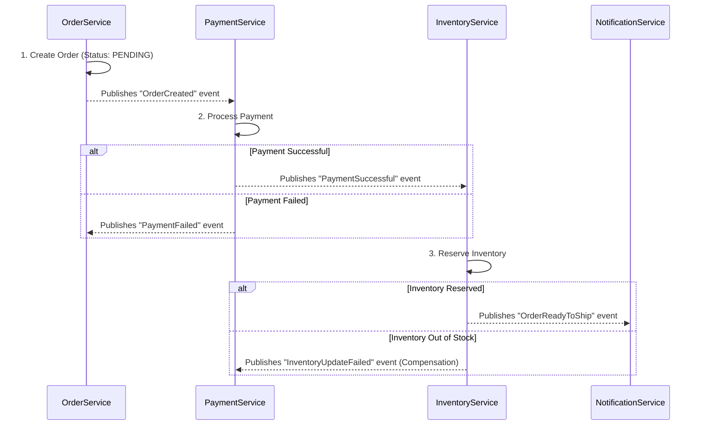
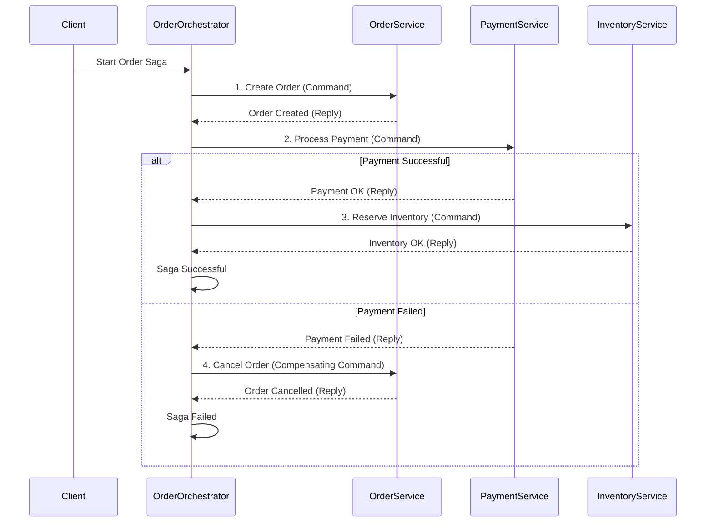

# Quản lý Transaction trong Microservices: The Saga Pattern

Trong thế giới microservices, chúng ta không thể có một transaction ACID trải dài trên nhiều service (mỗi service có database riêng). Các nỗ lực để làm điều này (ví dụ: Two-Phase Commit) thường dẫn đến hệ thống phức tạp, chậm chạp và dễ đổ vỡ.

Thay vào đó, chúng ta sử dụng **Saga Pattern**.

## 1. Saga là gì?

Một Saga là một chuỗi các **local transactions** (giao dịch cục bộ) được phối hợp với nhau để hoàn thành một nghiệp vụ tổng thể. Mỗi local transaction sẽ cập nhật dữ liệu trong một service duy nhất.

- **Nếu tất cả các bước thành công**: Nghiệp vụ hoàn tất.
- **Nếu một bước thất bại**: Saga sẽ thực thi các **compensating transactions** (giao dịch bù trừ) để "hoàn tác" lại công việc đã làm ở các bước trước đó.

**Quan trọng**: Saga đảm bảo **Atomicity** (hoặc tất cả thành công, hoặc tất cả được hoàn tác) nhưng hy sinh **Isolation**. Dữ liệu có thể ở trạng thái không nhất quán tạm thời trong khi Saga đang chạy. Đây là **Eventual Consistency (Nhất quán cuối cùng)**.

## 2. Các loại Saga

Có hai cách chính để phối hợp một Saga:

### a. Choreography (Kịch bản phân tán)

Trong mô hình này, không có một điểm điều phối trung tâm. Các service tự liên lạc với nhau thông qua việc phát và lắng nghe **sự kiện (events)**.

- **Cách hoạt động**: Service đầu tiên thực hiện local transaction và phát ra một sự kiện. Service tiếp theo lắng nghe sự kiện đó, thực hiện công việc của mình và phát ra một sự kiện mới. Cứ thế tiếp tục.
- **Ưu điểm**: Đơn giản, không có điểm lỗi trung tâm (single point of failure), các service được découple.
- **Nhược điểm**: Khó theo dõi luồng nghiệp vụ (ai đang gọi ai?). Dễ bị "circular dependencies" khi có nhiều service.

**Ví dụ: Đặt hàng (Choreography)**

### b. Orchestration (Kịch bản điều phối)

Trong mô hình này, có một **Orchestrator** (bộ điều phối) trung tâm chịu trách nhiệm điều khiển luồng đi của Saga.

- **Cách hoạt động**: Orchestrator gửi các lệnh (commands) đến từng service để yêu cầu chúng thực hiện một hành động. Sau khi service hoàn thành, nó báo cáo lại cho Orchestrator. Orchestrator sẽ quyết định bước tiếp theo.
- **Ưu điểm**: Luồng nghiệp vụ được tập trung, dễ hiểu và dễ quản lý. Dễ dàng hơn trong việc xử lý lỗi và logic phức tạp.
- **Nhược điểm**: Orchestrator có thể trở thành điểm lỗi trung tâm. Tăng coupling giữa orchestrator và các service tham gia.

**Ví dụ: Đặt hàng (Orchestration)**

## 3. Compensating Transactions (Giao dịch bù trừ)

Đây là chìa khóa để "rollback" trong một Saga. Một compensating transaction phải là một hành động **idempotent** (có thể gọi nhiều lần mà không thay đổi kết quả) và có khả năng **không bao giờ thất bại**.

| Hành động | Giao dịch bù trừ |
| :--- | :--- |
| Reserve Inventory | Release Inventory |
| Process Payment | Refund Payment |
| Create Order | Cancel Order |

## 4. Khi nào nên sử dụng Saga?

- **Khi bạn có một nghiệp vụ trải dài trên nhiều service.**
- **Khi bạn có thể chấp nhận Eventual Consistency.**
- **Khi bạn muốn giữ các service của mình được découple.**

**Khi nào KHÔNG nên sử dụng Saga?**
- Nếu có thể, hãy **thiết kế lại service boundaries** để một nghiệp vụ chỉ nằm trong một service duy nhất. Đây luôn là lựa chọn ưu tiên. Saga làm tăng độ phức tạp đáng kể cho hệ thống.
- Khi nghiệp vụ yêu cầu **tính nhất quán ngay lập tức (instant consistency)**.

## 5. Kết luận cho Microservices

- **Từ bỏ 2PC**: Tránh xa distributed ACID transactions.
- **Nắm lấy Saga**: Sử dụng Saga Pattern để quản lý nghiệp vụ trên nhiều service.
- **Chọn mô hình phù hợp**: **Choreography** cho các Saga đơn giản, **Orchestration** cho các luồng phức tạp.
- **Thiết kế Compensating Transactions cẩn thận**: Đây là phần quan trọng nhất để đảm bảo tính toàn vẹn.
- **Ưu tiên tái cấu trúc**: Trước khi implement một Saga, hãy tự hỏi: "Liệu tôi có thể thay đổi ranh giới của các service để tránh nó không?".