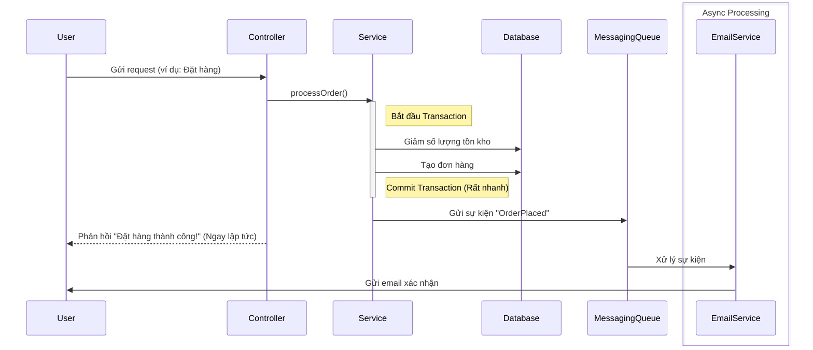

# Chiến lược Transaction cho Ứng dụng Web: Hiệu suất và Trải nghiệm người dùng

Trong ứng dụng web, việc quản lý transaction không chỉ ảnh hưởng đến tính toàn vẹn dữ liệu mà còn tác động trực tiếp đến **thời gian phản hồi** và **trải nghiệm người dùng**. Một transaction kéo dài có thể khiến người dùng phải chờ đợi, gây ra trải nghiệm tồi tệ.

Mục tiêu chính là: **Giữ cho transaction càng ngắn gọn càng tốt.**

## 1. Nguyên tắc cốt lõi: Tách biệt I/O và Logic

Một trong những sai lầm phổ biến nhất là thực hiện các thao tác tốn thời gian (gọi API ngoài, gửi email, xử lý file) bên trong một transaction của database. Điều này sẽ giữ lock trên các bảng dữ liệu quá lâu, làm giảm hiệu suất toàn hệ thống.

**Luồng xử lý TỐT:**

1.  **Bắt đầu Transaction.**
2.  Thực hiện các thao tác CSDL (INSERT, UPDATE, DELETE).
3.  **Kết thúc (Commit) Transaction.**
4.  Thực hiện các tác vụ I/O hoặc bất đồng bộ (gửi email, gọi API).



## 2. Các mẫu thiết kế (Design Patterns) phổ biến

### Mẫu 1: Read-Only Operations (Tác vụ chỉ đọc)

-   **Kịch bản**: Hiển thị thông tin sản phẩm, danh sách bài viết, thông tin người dùng.
-   **Chiến lược**:
    -   Sử dụng `@Transactional(readOnly = true)`.
    -   **Isolation Level**: `READ_COMMITTED` là đủ cho hầu hết các trường hợp. Nó đảm bảo bạn không đọc phải dữ liệu "bẩn" và có hiệu suất tốt.
-   **Lý do**: `readOnly = true` cho phép JPA/Hibernate bỏ qua cơ chế "dirty checking", giúp cải thiện hiệu suất. Không cần mức isolation cao hơn vì việc dữ liệu thay đổi một chút trong lúc người dùng xem thường không phải là vấn đề lớn.

```java
@Transactional(readOnly = true, isolation = Isolation.READ_COMMITTED)
public ProductDTO getProductDetails(Long productId) {
    // Chỉ đọc dữ liệu, không thay đổi
    return productRepository.findById(productId)
        .map(this::convertToDTO)
        .orElseThrow(() -> new ProductNotFoundException());
}
```

### Mẫu 2: Single, Simple Write (Ghi đơn giản)

-   **Kịch bản**: Người dùng cập nhật tên, địa chỉ; thay đổi avatar; bấm "like" một bài viết.
-   **Chiến lược**:
    -   Sử dụng `@Transactional` với cài đặt mặc định (`REQUIRED`, `READ_COMMITTED`).
    -   Giữ cho logic trong service method cực kỳ đơn giản.
-   **Lý do**: Các thao tác này thường chỉ ảnh hưởng đến một hoặc hai bảng. Transaction diễn ra nhanh chóng, vì vậy các thiết lập mặc định là đủ an toàn và hiệu quả.

```java
@Transactional
public void updateUserProfile(Long userId, UserProfileDTO dto) {
    User user = userRepository.findById(userId).orElseThrow();
    user.setName(dto.getName());
    user.setAddress(dto.getAddress());
    // userRepository.save(user) sẽ được tự động gọi khi transaction commit
}
```

### Mẫu 3: Complex Business Logic (Nghiệp vụ phức tạp)

-   **Kịch bản**: Đặt hàng (giảm tồn kho, tạo đơn hàng, tính khuyến mãi), đăng ký người dùng (tạo user, tạo profile, tạo wallet).
-   **Chiến lược**:
    -   **Phạm vi transaction**: Chỉ bao gồm các thao tác CSDL cốt lõi.
    -   **Isolation Level**: Cân nhắc `REPEATABLE_READ` nếu logic của bạn phụ thuộc vào dữ liệu đã đọc trước đó. Ví dụ: đọc số lượng tồn kho, kiểm tra, rồi mới trừ đi. `REPEATABLE_READ` sẽ ngăn người khác thay đổi số lượng đó trong lúc bạn đang xử lý.
    -   **Xử lý bất đồng bộ**: Tách các tác vụ phụ (gửi email, tạo thông báo) ra xử lý bất đồng bộ qua message queue (RabbitMQ, Kafka) hoặc `@Async`.

```java
@Service
public class OrderService {
    
    @Autowired private ApplicationEventPublisher eventPublisher;

    @Transactional(isolation = Isolation.REPEATABLE_READ)
    public Order placeOrder(OrderRequest request) {
        // 1. Kiểm tra tồn kho (đọc)
        Product product = productRepository.findById(request.getProductId()).orElseThrow();
        if (product.getStock() < request.getQuantity()) {
            throw new OutOfStockException();
        }

        // 2. Trừ tồn kho (ghi)
        product.setStock(product.getStock() - request.getQuantity());

        // 3. Tạo đơn hàng (ghi)
        Order order = new Order(...);
        orderRepository.save(order);

        // 4. Phát sự kiện để xử lý bất đồng bộ
        eventPublisher.publishEvent(new OrderPlacedEvent(this, order));

        return order;
        // Transaction commit tại đây
    }
}

@Component
public class OrderNotificationListener {
    @EventListener
    @Async // Chạy trên một thread khác, không ảnh hưởng transaction chính
    public void handleOrderPlaced(OrderPlacedEvent event) {
        // Gửi email, gọi API, v.v.
        emailService.sendOrderConfirmation(event.getOrder());
    }
}
```

## 3. Anti-Patterns: Những điều cần tránh

-   **Transaction dài hơi (Long-running Transaction)**: Không bao giờ đặt các cuộc gọi mạng (API call), xử lý file, hoặc các vòng lặp phức tạp bên trong `@Transactional`.
-   **Swallowing Exceptions (Nuốt ngoại lệ)**: Bắt `Exception` bên trong một method `@Transactional` mà không ném lại nó sẽ khiến Spring nghĩ rằng mọi thứ đều ổn và **COMMIT** transaction, dẫn đến dữ liệu không nhất quán.
-   **Lạm dụng `SERIALIZABLE`**: Chỉ sử dụng mức isolation cao nhất khi thực sự, thực sự cần thiết. Nó là "kẻ thù" của hiệu suất trong ứng dụng web có tải cao.

## 4. Kết luận cho Ứng dụng Web

| Kịch bản | Chiến lược đề xuất | Ghi chú |
| :--- | :--- | :--- |
| **Đọc dữ liệu** | `@Transactional(readOnly = true, isolation = READ_COMMITTED)` | Tối ưu cho hiệu suất. |
| **Ghi dữ liệu đơn giản** | `@Transactional` (mặc định) | Giữ logic đơn giản, nhanh gọn. |
| **Nghiệp vụ phức tạp** | `@Transactional(isolation = REPEATABLE_READ)` + Xử lý bất đồng bộ | Đảm bảo nhất quán cho logic cốt lõi, tách các tác vụ phụ ra ngoài. |
| **Tác vụ nền, không gấp** | `@Async` hoặc Message Queue | Không nên đặt trong transaction của request từ người dùng. |